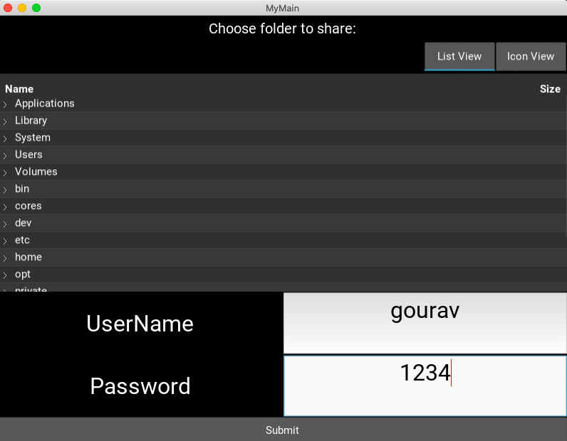
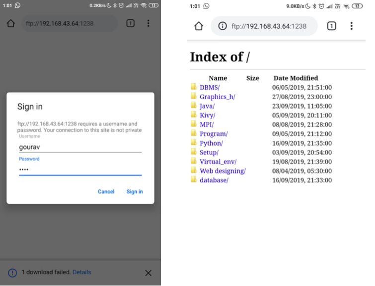

# pcFileShare
A desktop application for sharing files 
 
Note:- Sharer and receiver should be connected to same wireless network 
 
to run this you need to follow these steps: 
<b>Step 1</b> : place all files in any directory or folder of your pc and then open terminal/cmd in that directory 
<b>Step 2</b>: run these 2 commands on your terminal/ cmd on your pc 
     &nbsp;     pip install -r requirements.txt      ''' for fulfilling / installing the required dependencies ''' 
     &nbsp;    python main.py                        ''' for executing the code ''' 
<b>Step 3</b>: In app select files to be shared by App's filechooser and then set an username and password and click submit 
<b>Step 4</b>: Then click on get URL and tell the recipients to go to that url and enter the username and password created by sender in step 3. 
Now Enjoy Sharing 

Welcome Page
-------------

Select File to share and set userid and password
------

Click on get url button to get url that has to enter by the receiver in its browser
------------

View on receiver's end
-----

